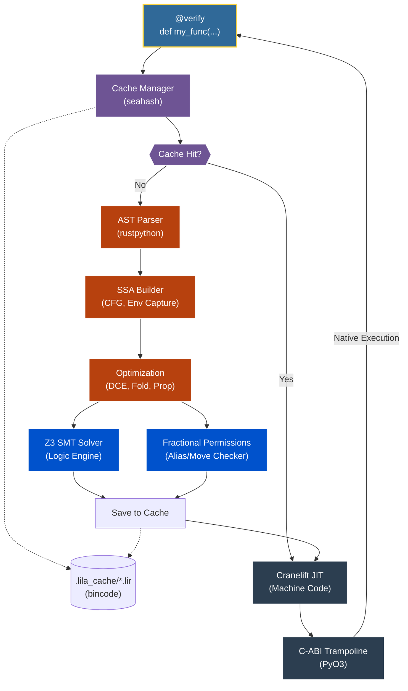

<div align="center">

# Lila

**A Formally Verified, Affine-Typed JIT Compiler for Python**

[](https://www.gnu.org/licenses/agpl-3.0)
[](https://www.rust-lang.org/)
[](https://www.python.org/)
[](https://github.com/Z3Prover/z3)
[](https://cranelift.dev/)

</div>

> [!WARNING]
> Lila is a proof-of-concept exploration into formal verification and affine types for Python. It is **not** a production-ready tool, is highly unstable, and should not be used in critical systems.

---

Python is beloved for its developer experience, but its type-hinting system is purely cosmetic. This "trust-based" model forces a choice: accept the heavy overhead of runtime checks and the Global Interpreter Lock (GIL) for safety, or drop into C/Rust—losing Python's productivity and introducing manual memory management risks.

Lila exists to break this dichotomy. It takes Python's "hints" and turns them into **mathematically enforced laws**. By using formal verification to prove code safety at compile-time, Lila bypasses the interpreter entirely, executing Python at bare-metal speeds without sacrificing the sound logic that prevents crashes, data races, and memory corruption.

## Table of Contents
- [The Lila Pipeline](#the-lila-pipeline)
- [Core Concepts & Examples](#core-concepts--examples)
  - [Mathematical Safety & Logic](#mathematical-safety--logic)
  - [Compile-Time Memory Safety (Affine Types)](#compile-time-memory-safety-affine-types)
  - [High-Performance Execution](#high-performance-execution)
  - [Verified Data Structures](#verified-data-structures)
  - [Developer Experience](#developer-experience)
- [Technical Specifications](#technical-specifications)
- [Getting Started](#getting-started)
- [Limitations & Roadmap](#limitations--roadmap)

---

## The Lila Architecture & Pipeline

Lila's architecture is built as a multi-crate Rust workspace, orchestrated by a Python frontend. The transformation from dynamic Python to verified machine code follows a strict pipeline, completely bypassing the CPython interpreter for the compiled functions.



### The Compilation Stages

1. **Interception & Hashing (`lila-bridge`):** The `@verify` decorator intercepts the Python function. The source code, structural memory layouts, and the current compiler version are hashed.
2. **AOT Caching:** If a valid `.lir` (Lila IR) binary exists in `.lila_cache/` for this hash, the system skips directly to Backend Lowering (Stage 6), achieving near-zero latency startup.
3. **AST Extraction (`lila-ir`):** On a cache miss, the Python AST is parsed and lowered into Lila's **Static Single Assignment (SSA)** Intermediate Representation, building the Control Flow Graph (CFG) and analyzing variable captures.
4. **Optimization (`lila-ir`):** The IR undergoes multiple passes including **Constant Folding**, **Dead Code Elimination (DCE)**, and **Type Propagation**.
5. **Formal Verification (`lila-verify`):**
   - *Logic Engine:* Every branch condition and mathematical operation is mapped to SMT-LIB logic and rigorously proven by the **Z3 Solver**.
   - *Permission Verifier:* A path-aware, flow-sensitive system evaluates **Fractional Permissions** to mathematically prove the absence of data races, aliasing violations, and use-after-moves.
6. **Backend Lowering (`lila-backend`):** The verified SSA is compiled via **Cranelift IR** into raw machine code (executable memory buffers).
7. **Hot-Swapping:** PyO3 generates a native C-ABI trampoline. Subsequent calls to the Python function bypass the interpreter entirely, executing the bare-metal code directly.

---

## Core Concepts & Examples

### Mathematical Safety & Logic

#### Liquid Types: Provable Logical Invariants
Lila uses refinement types to prove that operations are mathematically safe before they ever execute.
```python
from lila import verify, i64, Refined

# Define a refinement: x must be strictly greater than 0
Positive = Refined[i64, lambda x: x > 0]

@verify
def divide_verified(n: i64, d: Positive) -> i64:
    # Z3 proves d > 0. Runtime ZeroDivisionError is mathematically impossible.
    return n // d
```

#### Inductive Reasoning: Recursive Functions
Lila can formally prove properties of recursive functions using inductive hypotheses. It ensures that recursive calls satisfy the function's own refinements across inductive steps.
```python
from lila import verify, i64, Refined

StrictPositive = Refined[i64, lambda x: x >= 1]
SmallPos = Refined[i64, lambda x: (0 <= x) & (x <= 20)]

@verify
def factorial(n: SmallPos) -> StrictPositive:
    if n <= 1:
        return 1
    # Lila proves inductively: n * fac(n-1) >= 2 * 1 >= 1
    return n * factorial(n - 1)
```

#### Higher-Order Functions: First-Class Verified Logic
Lila supports closures and lambdas with full formal verification of their capture environments.
```python
from lila import verify, i64, Closure

@verify
def make_adder(x: i64) -> Closure[[i64], i64]:
    # Lila performs capture analysis and heap-allocates the environment
    return lambda y: x + y
```

---

### Compile-Time Memory Safety (Affine Types)

#### Fractional & Structural Permissions
Lila uses a path-aware, symbolic weight partitioning system to prevent data races and use-after-move errors. It tracks permissions down to individual struct fields, allowing disjoint mutations of the same object safely.
```python
from lila import verify, i64, Held, Hand, Peek, struct

@struct
class Data: val: i64

@verify
def illegal_use(x: Held[i64]) -> i64:
    val = consume(x)  # x is moved here (1.0 permission consumed)
    return x + 1      # COMPILE ERROR: Use-after-move (0.0 permission remaining)

@verify
def illegal_alias(d: Hand[Data]) -> i64:
    r1 = Peek(d)      # Shared permission created
    # d.val = 10      # ERROR: Cannot mutate 'd' while shared permissions are active
    return r1.val
```

#### Lexical Borrow Checking with `with`
You can explicitly scope shared permissions using Python's `with` context managers.
```python
@verify
def safe_borrow(d: Hand[Data]) -> i64:
    with Peek(d) as p:
        read_val = p.val
    
    # Exiting the block returns the fractional permission to 'd'.
    # Now it is safe to mutate 'd' again because we hold 1.0 permission.
    d.val = 20 
    return d.val + read_val
```

---

### High-Performance Execution

#### GIL-less Parallelism & Verified Data-Race Freedom
Since Lila code operates on raw memory, it executes across multiple threads without the Global Interpreter Lock (GIL). The Z3 solver mathematically proves the absence of data races at compile-time by enforcing that required mutable permissions cannot be scaled safely across concurrent iterations.
```python
from lila import verify, parallel_for, Buffer, f64, i64

@verify
def parallel_scale(vec: Buffer[f64], factor: f64) -> None:
    def body(i: i64):
        vec[i] *= factor
    parallel_for(0, len(vec), 1, body)
```

#### Ahead-of-Time (AOT) IR Caching
Lila caches its proven Intermediate Representation (IR) to disk in a fast binary format. If the Python source code, memory layouts, and compiler version remain unchanged, subsequent executions completely bypass AST parsing and the computationally expensive Z3 formal verification phase. The pre-verified IR is fed directly to Cranelift for near-instant execution startup times.

---

### Verified Data Structures

#### Memory-Mapped Structs
Define zero-overhead, C-compatible structures that exist outside the CPython heap.
```python
from lila import struct, f64, i32

@struct
class Point:
    x: f64
    y: f64
    id: i32

    def move_by(self, dx: f64, dy: f64):
        self.x += dx
        self.y += dy
```

#### Tagged Unions: Formally Verified Enums
Lila supports type-safe tagged unions with Z3-proven variant access.
```python
from lila import verify, i64, struct, enum

@struct
class SomePayload: val: i64

@enum
class Option:
    Some: SomePayload
    NoneVariant: None

@verify
def get_val(opt: Option) -> i64:
    if opt.is_Some():
        # Z3 proves this extraction is safe because of the branch above
        return opt.as_Some().val
    return -1
```

#### Verified Buffer and NumPy Interop
Seamlessly operate on high-performance memory buffers (like NumPy arrays) with Z3-proven bounds checking.
```python
from lila import verify, Buffer, f64

@verify
def scale_vector(vec: Buffer[f64], factor: f64) -> None:
    # Lila proves 'i' is always within [0, len(vec))
    for i in range(len(vec)):
        vec[i] *= factor
```

---

### Developer Experience

#### Source-Level Diagnostics
Lila provides visual highlights for verification failures, mapping IR-level logic errors back to your original Python source code for immediate debugging.
```text
[Lila Warning] Lila Verification Failed for 'divide_unsafe': Potential division by zero at v2
  --> source.py:3:12
   |
 3 |    return n // d
   |                ^--- Logic error detected here
```

#### Centralized Granular Tracing
Toggle granular debug levels for specific sub-systems directly from Python to isolate issues in the compiler pipeline.
```python
from lila import configure_tracing, LIVENESS, VERIFY, SSA

# Only see detailed liveness logs and SSA optimizations
configure_tracing({
    LIVENESS: "debug", 
    SSA: "debug",
    VERIFY: "info"
})
```

---

## Technical Specifications

| Feature | Support / Technology |
| :--- | :--- |
| **Core Architecture** | Multi-crate Rust Workspace (`lila-core`, `lila-ir`, `lila-verify`, `lila-backend`, `lila-bridge`) |
| **Numeric Types** | `i8` through `u64`, `f32`, `f64` |
| **Functional Types**| `FnPointer`, `Closure`, `Callable` |
| **Complex Types** | Structs, Tagged Unions (Enums), Tuples |
| **Concurrency** | GIL-less multi-threading (`parallel_for`) |
| **Memory Model** | Fractional & Structural Permissions (Data-race free, Affine semantics) |
| **Logic Solver** | Z3 SMT Solver v4.12+ (BV & Float Theories) |
| **JIT Backend** | Cranelift 0.100+ |
| **AOT Caching** | Binary IR Serialization (`bincode`, `seahash`) |
| **Interoperability** | PyO3, ctypes, NumPy, Buffer Protocol |
| **Diagnostics** | Source-level visual highlights, Centralized Granular Tracing |
| **Optimization Passes**| SSA-DCE (Self-Protecting), Constant Folding, Type Propagation |

---

## Getting Started

### Prerequisites
- **Rust Toolchain** (latest stable)
- **Python 3.8+**
- **Z3 Solver** (shared library v4.12+)

### Installation and Testing
```bash
# Build Lila in release mode
maturin develop --release

# Run verification test suite
cargo test
python -m unittest tests/python/*.py
```

---

## Limitations & Roadmap

### The "Closed World Assumption"
To maintain mathematical soundness, Lila imposes strict constraints:
*   No dynamic attribute access (`getattr`, `setattr`).
*   No `eval()` or `exec()`.
*   Functions must have explicit type annotations.

### Future Research
1. **Transition to Aeneas and F*:** Moving from Z3 to Aeneas and F* would allow for **Absolute Formal Proof**, shifting the project from "highly likely safe" to "mathematically certain".
2. **Automated Loop Invariant Synthesis:** Researching Abstract Interpretation to automatically derive loop invariants.
3. **IEEE 754 Floating-Point Proofs:** Extending the bit-accurate model to prove stability and bound precision loss in complex numerical algorithms.

---

<div align="center">

Built with 🦀 & 🐍 by [Seuriin](https://github.com/SSL-ACTX)

</div>
