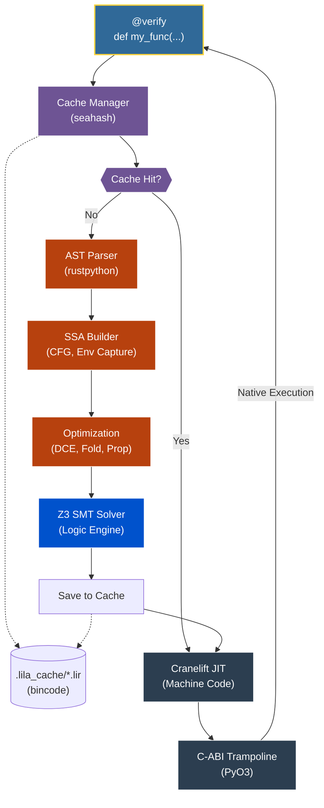

<div align="center">

# Lila

**A Formally Verified JIT Compiler for Python**

[](https://www.gnu.org/licenses/agpl-3.0)
[](https://www.rust-lang.org/)
[](https://www.python.org/)
[](https://github.com/Z3Prover/z3)
[](https://cranelift.dev/)

</div>

> [!WARNING]
> Lila is a proof-of-concept exploration into formal verification for Python. It is **not** a production-ready tool, is highly unstable, and should not be used in critical systems.

---

Python is beloved for its developer experience, but its type-hinting system is purely cosmetic. This "trust-based" model forces a choice: accept the heavy overhead of runtime checks and the Global Interpreter Lock (GIL) for safety, or drop into C/Rust—losing Python's productivity and introducing manual memory management risks.

Lila exists to break this dichotomy. It takes Python's "hints" and turns them into **mathematically enforced laws**. By using formal verification to prove code safety at compile-time, Lila bypasses the interpreter entirely, executing Python at bare-metal speeds without sacrificing the sound logic that prevents crashes and data corruption.

### Key Features
*   **Mathematical Soundness:** Liquid Types and Z3-backed formal verification prove the absence of crashes, out-of-bounds, and logic errors.
*   **Verified Tensors:** Formally verified element-wise arithmetic and reductions with Z3 shape-aware validation.
*   **Bare-Metal Performance:** Bypasses the CPython interpreter and GIL entirely using the Cranelift JIT.
*   **Flat Value Types:** Stack-allocated, non-boxed structs (`@value`) for zero-overhead data processing and cache-efficient layouts.
*   **Runtime Monomorphization:** Specialized JIT compilation for generic functions using Python `TypeVar` for zero-overhead abstractions.
*   **Native SIMD:** Direct access to CPU vector registers (`f32x4`, `i32x4`, etc.) from within Python.
*   **Verified Loop Unrolling:** Compile-time constant tracking and CFG unrolling for optimized execution using `Literal` types.
*   **AOT Caching:** Near-zero latency startup by caching verified IR to disk.

## Table of Contents
- [Core Concepts & Examples](#core-concepts--examples)
  - [Mathematical Safety & Logic](#mathematical-safety--logic)
  - [High-Performance Execution](#high-performance-execution)
  - [Verified Data Structures](#verified-data-structures)
  - [Developer Experience](#developer-experience)
- [The Lila Architecture & Pipeline](#the-lila-architecture--pipeline)
- [Technical Specifications](#technical-specifications)
- [Getting Started](#getting-started)
- [Limitations & Roadmap](#limitations--roadmap)

---

## Core Concepts & Examples

### Mathematical Safety & Logic

#### Liquid Types: Provable Logical Invariants
Lila uses refinement types to prove that operations are mathematically safe before they ever execute. It can also **infer postconditions** using `...`, automatically deriving the strongest possible predicates via interval analysis.
```python
from lila import verify, i64, Refined

# Define a refinement: x must be strictly greater than 0
Positive = Refined[i64, lambda x: x > 0]

@verify
def divide_verified(n: i64, d: Positive) -> i64:
    # Z3 proves d > 0. Runtime ZeroDivisionError is mathematically impossible.
    return n // d

@verify
def infer_bounds(x: i64) -> Refined[i64, ...]:
    # Lila automatically infers the return postcondition: (and (>= {v} 1) (<= {v} 10))
    if x > 10: return 10
    if x < 1: return 1
    return x
```

#### Inductive Reasoning: Recursive Functions
Lila can formally prove properties of recursive functions using inductive hypotheses. It ensures that recursive calls satisfy the function's own refinements across inductive steps.
```python
from lila import verify, i64, Refined

StrictPositive = Refined[i64, lambda x: x >= 1]
SmallPos = Refined[i64, lambda x: (0 <= x) & (x <= 20)]

@verify
def factorial(n: SmallPos) -> StrictPositive:
    if n <= 1:
        return 1
    # Lila proves inductively: n * fac(n-1) >= 2 * 1 >= 1
    return n * factorial(n - 1)
```

#### Higher-Order Functions: First-Class Verified Logic
Lila supports closures and lambdas with full formal verification of their capture environments.
```python
from lila import verify, i64, Closure

@verify
def make_adder(x: i64) -> Closure[[i64], i64]:
    # Lila performs capture analysis and heap-allocates the environment
    return lambda y: x + y
```

---

### High-Performance Execution

#### GIL-less Parallelism
Since Lila code operates on raw memory, it executes across multiple threads without the Global Interpreter Lock (GIL).
```python
from lila import verify, parallel_for, Buffer, f64, i64

@verify
def parallel_scale(vec: Buffer[f64], factor: f64) -> None:
    def body(i: i64):
        vec[i] *= factor
    parallel_for(range(len(vec)), body)
```

#### Concept-Based Static Dispatch
Lila hijacks `typing.Protocol` to implement zero-cost static dispatch. Functions annotated with a Protocol are specialized for each concrete struct at compile-time, eliminating VTables and dynamic lookups.
```python
from typing import Protocol
from lila import verify, f32, struct

class Renderable(Protocol):
    def render(self) -> f32: ...

@struct
class Circle:
    radius: f32
    def render(self) -> f32:
        return self.radius * 3.14

@verify
def draw(obj: Renderable) -> f32:
    return obj.render() # Statically dispatched!
```

#### Zero-Cost Null-Pointer Optimization
Lila optimizes `Optional[Box[T]]` (or `Box[T] | None`) by representing `None` as the raw memory address `0x0`. Z3 formally proves that the code never dereferences a pointer unless it is non-null.
```python
@struct
class Node:
    val: i64
    next: Optional[Box["Node"]]

@verify
def sum_list(n: Optional[Box[Node]]) -> i64:
    if n is None: return 0
    return n.val + sum_list(n.next) # Safety proved by Z3
```

#### Runtime Monomorphization
Lila uses Python's `typing.TypeVar` and `Ellipsis` to implement zero-overhead generics and rank-polymorphism. Functions are lazily specialized and JIT-compiled for specific types and tensor ranks at the first call site, similar to C++ templates.
```python
from typing import TypeVar
from lila import verify, i64, f64, Tensor

T = TypeVar("T", i64, f64)

@verify
def identity(x: T) -> T:
    return x

# Lila generates specialized machine code for each variant
res_int = identity(42)    # specialized for i64
res_flt = identity(3.14)  # specialized for f64

@verify
def first_elt(a: Tensor[f64, ...]) -> f64:
    return a[0, 0] # Specialized for the specific rank at runtime
```

#### Verified Loop Unrolling
By using `typing.Literal`, Lila can track compile-time constants and perform robust loop unrolling. This eliminates loop overhead and provides Z3 with exact induction values for indexing proofs.
```python
from typing import Literal
from lila import verify, i64

@verify
def unrolled_sum(limit: Literal[5]) -> i64:
    total = 0
    # Lila unrolls this loop completely into 5 discrete blocks
    for i in range(limit):
        total += i
    return total
```

#### Ahead-of-Time (AOT) IR Caching
Lila caches its proven Intermediate Representation (IR) to disk in a fast binary format. If the Python source code, memory layouts, and compiler version remain unchanged, subsequent executions completely bypass AST parsing and the computationally expensive Z3 formal verification phase. The pre-verified IR is fed directly to Cranelift for near-instant execution startup times.

#### Native SIMD (Vectorized) Execution
Lila exposes native CPU vector registers directly to Python, allowing for high-performance math that bypasses NumPy's calling overhead. It supports floating-point vectors (`f32x4`, `f64x2`) as well as a full suite of integer vectors including 8-bit and 16-bit types (`i8x16`, `u8x16`, `i16x8`, `u16x8`, `i32x4`, `i64x2`).
```python
from lila import verify, i8x16

@verify
def process_pixels(a: i8x16, b: i8x16) -> i8x16:
    # Compiles to a single native SIMD instruction
    # Automatic splatting broadcasts scalars (e.g., 10) to all vector lanes
    return (a + b) - 10
```

---

### Verified Data Structures

#### Memory-Mapped Structs
Define zero-overhead, C-compatible structures that exist outside the CPython heap. Lila supports **Nested Refinements**, allowing you to prove properties deep within a structure's hierarchy.
```python
from lila import struct, f64, i32, Refined

@struct
class Point:
    x: f64
    y: f64

@struct
class Trace:
    p: Point
    id: i32

# Formally prove properties of nested fields
SafeTrace = Refined[Trace, lambda t: t.p.x > 0]
```

#### Flat Value Types
Lila supports stack-allocated, non-boxed structs (`@value`) that provide zero-overhead data processing. Unlike heap-allocated `@struct`, `@value` types have value semantics and are laid out contiguously in memory, making them ideal for high-performance buffer operations.
```python
from lila import value, i64, Buffer, verify

@value
class Point3D:
    x: i64
    y: i64
    z: i64

@verify
def process_points(data: Buffer[Point3D]) -> None:
    # Lila optimizes this to raw pointer arithmetic with zero boxing overhead
    for i in range(len(data)):
        total = data[i].x + 1
```

#### Verified Tensors
Lila provides first-class support for tensors with shape-aware formal verification. Operations like element-wise arithmetic and reductions are proven safe against shape mismatches and mathematical violations. It supports **Rank-Polymorphism** using `...`, allowing a single function to operate on tensors of any rank that satisfy a suffix shape.
```python
from lila import verify, Tensor, f32

@verify
def rank_poly_compute(a: Tensor[f32, ..., "N"], b: Tensor[f32, ..., "N"]) -> f32:
    # Lila proves that 'a' and 'b' have the same rank and that their 
    # last dimensions match 'N' at runtime via monomorphization.
    res = (a + b) * 2.0
    return res.sum()
```

#### Recursive ADTs: Formally Verified Linked Lists
Lila supports heap-allocated recursive data structures with full formal verification of their variant access.
```python
from lila import verify, i64, adt, Box

@adt
class Node:
    Cons: (i64, Box["Node"])
    Nil: None

@verify
def sum_list(n: Node) -> i64:
    match n:
        case Node.Cons(val, next):
            return val + sum_list(next)
        case Node.Nil:
            return 0
```

#### Verified Buffer and NumPy Interop
Seamlessly operate on high-performance memory buffers (like NumPy arrays) with Z3-proven bounds checking.
```python
from lila import verify, Buffer, f64

@verify
def scale_vector(vec: Buffer[f64], factor: f64) -> None:
    # Lila proves 'i' is always within [0, len(vec))
    for i in range(len(vec)):
        vec[i] *= factor
```

---

### Developer Experience

#### Source-Level Diagnostics
Lila provides visual highlights for verification failures, mapping IR-level logic errors back to your original Python source code for immediate debugging.
```text
[Lila Warning] Lila Verification Failed for 'divide_unsafe': Potential division by zero at v2
  --> source.py:3:12
   |
 3 |    return n // d
   |                ^--- Logic error detected here
```

#### Centralized Granular Tracing
Toggle granular debug levels for specific sub-systems directly from Python to isolate issues in the compiler pipeline.
```python
from lila import configure_tracing, LIVENESS, VERIFY, SSA

# Only see detailed liveness logs and SSA optimizations
configure_tracing({
    LIVENESS: "debug", 
    SSA: "debug",
    VERIFY: "info"
})
```

---

## The Lila Architecture & Pipeline

Lila's architecture is built as a multi-crate Rust workspace, orchestrated by a Python frontend. The transformation from dynamic Python to verified machine code follows a strict pipeline, completely bypassing the CPython interpreter for the compiled functions.



### The Compilation Stages

1. **Interception & Hashing (`lila-bridge`):** The `@verify` decorator intercepts the Python function. The source code, structural memory layouts, and the current compiler version are hashed.
2. **AOT Caching:** If a valid `.lir` (Lila IR) binary exists in `.lila_cache/` for this hash, the system skips directly to Backend Lowering (Stage 6), achieving near-zero latency startup.
3. **AST Extraction (`lila-ir`):** On a cache miss, the Python AST is parsed and lowered into Lila's **Static Single Assignment (SSA)** Intermediate Representation, building the Control Flow Graph (CFG) and analyzing variable captures.
4. **Optimization (`lila-ir`):** The IR undergoes multiple passes including **Constant Folding**, **Dead Code Elimination (DCE)**, and **Type Propagation**.
5. **Formal Verification (`lila-verify`):** Every branch condition, mathematical operation, and memory access is mapped to SMT-LIB logic and rigorously proven by the **Z3 Solver**. Refinement types are checked across all reachable paths.
6. **Backend Lowering (`lila-backend`):** The verified SSA is compiled via **Cranelift IR** into raw machine code (executable memory buffers).
7. **Hot-Swapping:** PyO3 generates a native C-ABI trampoline. Subsequent calls to the Python function bypass the interpreter entirely, executing the bare-metal code directly.

---

## Technical Specifications

| Feature | Support / Technology |
| :--- | :--- |
| **Core Architecture** | Multi-crate Rust Workspace (`lila-core`, `lila-ir`, `lila-verify`, `lila-backend`, `lila-bridge`) |
| **Numeric Types** | `i8` through `u64`, `f32`, `f64`, `SIMD (f32x4, etc.)` |
| **Generics** | Runtime Monomorphization (`TypeVar`) |
| **Functional Types**| `FnPointer`, `Closure`, `Callable` |
| **Complex Types** | Structs, Tensors, Tagged Unions (ADTs), Tuples, Boxed Types |
| **Concurrency** | GIL-less multi-threading (`parallel_for`) |
| **Logic Solver** | Z3 SMT Solver v4.12+ (BV & Float Theories) |
| **JIT Backend** | Cranelift 0.100+ |
| **AOT Caching** | Binary IR Serialization (`bincode`, `seahash`) |
| **Interoperability** | PyO3, ctypes, NumPy, Buffer Protocol |
| **Diagnostics** | Source-level visual highlights, Centralized Granular Tracing |
| **Optimization Passes**| SSA-DCE, Constant Folding, Verified Loop Unrolling, Type Propagation |

---

## Getting Started

### Prerequisites
- **Rust Toolchain** (latest stable)
- **Python 3.8+**
- **Z3 Solver** (shared library v4.12+)

### Installation and Testing
```bash
# Build Lila in release mode
maturin develop --release

# Run verification test suite
cargo test
PYTHONPATH=./python python -m unittest discover tests/python
```

---

## Limitations & Roadmap

### The "Closed World Assumption"
To maintain mathematical soundness, Lila imposes strict constraints:
*   No dynamic attribute access (`getattr`, `setattr`).
*   No `eval()` or `exec()`.
*   Functions must have explicit type annotations.

### Future Research
1. **Automated Loop Invariant Synthesis:** Researching Abstract Interpretation to automatically derive loop invariants.

---

<div align="center">

Built with 🦀 & 🐍 by [Seuriin](https://github.com/SSL-ACTX)

</div>
