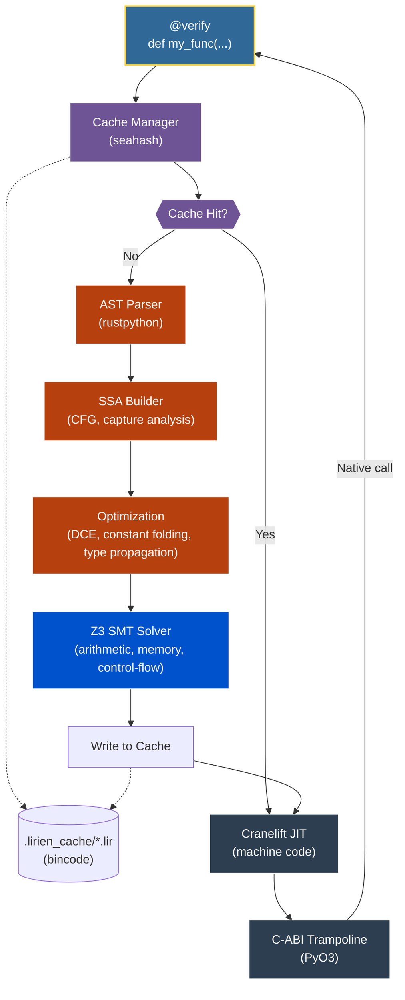

<div align="center">

# Lirien

**A Verifying JIT Compiler for a Safe Subset of Python**

[](https://www.gnu.org/licenses/agpl-3.0)
[](https://www.rust-lang.org/)
[](https://www.python.org/)
[](https://github.com/Z3Prover/z3)
[](https://cranelift.dev/)

</div>

> [!WARNING]
> Lirien is an experimental research compiler. It is not production-ready, is under active development, and should not be used in critical systems.

---

Python's type annotations are unenforced at runtime. The standard trade-off is to accept the overhead of runtime checks and the Global Interpreter Lock (GIL) for safety, or to rewrite performance-critical code in a systems language at the cost of development complexity. Lirien takes a different approach: it treats type annotations as formal specifications, uses an SMT solver to prove their correctness at compile time, and then emits native machine code directly, bypassing the CPython interpreter.

The result is a compiler that can statically guarantee the absence of certain classes of errors—division by zero, out-of-bounds accesses, null pointer dereferences—while executing at native speed.

### Feature Overview

- **Refinement Types:** Logical predicates attached to types and verified by Z3 across all reachable control-flow paths.
- **Formal Memory Safety:** Z3 proves non-nullity before every pointer dereference and validates all buffer accesses against their declared bounds.
- **Native Code Generation:** Functions decorated with `@verify` are compiled to machine code via Cranelift and called directly through a C-ABI trampoline, bypassing the CPython interpreter and GIL.
- **Flat Struct Layout:** `@struct` and `@value` types are compiled to C-compatible, flat memory layouts. Nested structs are inlined by byte offset, not represented as pointer chains.
- **Const Generics and Type-Level Arithmetic:** Integer dimensions are bound statically using `TypeVar`, and symbolic arithmetic (e.g., `N + 1`) is evaluated at JIT time.
- **Variadic Generics:** Tensor ranks and generic dimension sequences are expressed using `TypeVarTuple` and `Unpack`, enabling rank-polymorphic functions.
- **Monomorphization:** Generic functions (via `TypeVar`) are lazily specialized per concrete type at the call site.
- **SIMD Types:** Direct access to 128-bit CPU vector registers (`f32x4`, `f64x2`, `i8x16`, `i16x8`, `i32x4`, `i64x2`, `u8x16`, `u16x8`).
- **Loop Unrolling via `Literal`:** `typing.Literal`-typed integer parameters are treated as compile-time constants, enabling full CFG-level loop unrolling with exact Z3 induction values.
- **AOT IR Caching:** Verified SSA IR is serialized to disk (`.lirien_cache/`). On a cache hit, AST parsing and Z3 verification are skipped entirely.

## Table of Contents
- [Core Concepts & Examples](#core-concepts--examples)
  - [Refinement Types & Logic](#refinement-types--logic)
  - [Performance & Dispatch](#performance--dispatch)
  - [Data Structures](#data-structures)
  - [Developer Tooling](#developer-tooling)
- [Architecture & Pipeline](#architecture--pipeline)
- [Technical Specifications](#technical-specifications)
- [Getting Started](#getting-started)
- [Limitations & Roadmap](#limitations--roadmap)

---

## Core Concepts & Examples

### Refinement Types & Logic

#### Liquid Types: Statically Enforced Invariants
A refinement type is a base type paired with a logical predicate. Z3 checks that every assignment and function call satisfies the predicate along all reachable paths. Lirien can also infer postconditions automatically using `...`, deriving the tightest interval bounds via static analysis.

```python
from lirien import verify, i64, Refined

# Positive constrains i64 to values strictly greater than 0.
Positive = Refined[i64, lambda x: x > 0]

@verify
def divide_verified(n: i64, d: Positive) -> i64:
    # Z3 proves d > 0 holds at this call site.
    # A ZeroDivisionError is statically impossible.
    return n // d

@verify
def clamp(x: i64) -> Refined[i64, ...]:
    # Lirien infers the postcondition: (and (>= {v} 1) (<= {v} 10))
    if x > 10: return 10
    if x < 1: return 1
    return x
```

#### Inductive Proofs: Recursive Functions
For recursive functions, Lirien applies inductive reasoning: it assumes the refinement holds for recursive calls and verifies that the base case and inductive step both satisfy the declared postcondition.

```python
from lirien import verify, i64, Refined

SmallPos = Refined[i64, lambda x: (0 <= x) & (x <= 20)]
StrictPositive = Refined[i64, lambda x: x >= 1]

@verify
def factorial(n: SmallPos) -> StrictPositive:
    if n <= 1:
        return 1
    # Z3 proves: for all n in SmallPos, n * factorial(n-1) >= 1
    return n * factorial(n - 1)
```

#### Higher-Order Functions
Closures and lambdas are supported with full capture analysis. The captured environment is heap-allocated and tracked through the type system.

```python
from lirien import verify, i64, Closure

@verify
def make_adder(x: i64) -> Closure[[i64], i64]:
    return lambda y: x + y
```

---

### Performance & Dispatch

#### GIL-free Parallelism
Lirien functions operate on raw memory rather than CPython objects, which means they can be executed across multiple OS threads without acquiring the GIL.

```python
from lirien import verify, parallel_for, Buffer, f64, i64

@verify
def parallel_scale(vec: Buffer[f64], factor: f64) -> None:
    def body(i: i64):
        vec[i] *= factor
    parallel_for(range(len(vec)), body)
```

#### Static Dispatch via `typing.Protocol`
`typing.Protocol` is used to express structural interfaces. Functions accepting a Protocol parameter are monomorphized at the call site: a separate, specialized machine-code body is emitted for each concrete struct type, eliminating dynamic dispatch and vtable lookups.

```python
from typing import Protocol
from lirien import verify, f32, struct

class Renderable(Protocol):
    def render(self) -> f32: ...

@struct
class Circle:
    radius: f32
    def render(self) -> f32:
        return self.radius * 3.14

@verify
def draw(obj: Renderable) -> f32:
    # Compiled as a direct call to Circle_render.
    return obj.render()
```

#### Null-Pointer Optimization
`Optional[Box[T]]` (equivalently `Box[T] | None`) is represented as a raw 64-bit pointer where `None` is the address `0x0`. No wrapper object is allocated. Z3 proves non-nullity before every dereference; accessing `.val` or any field on a potentially-null pointer without a prior `None` check is a compile-time error.

```python
@struct
class Node:
    val: i64
    next: Optional[Box["Node"]]

@verify
def sum_list(n: Optional[Box[Node]]) -> i64:
    if n is None: return 0
    return n.val + sum_list(n.next)
```

#### Monomorphization and Const Generics
`TypeVar` is used for generic type parameters and for integer "const generics" (integer dimensions bound at JIT time). Symbolic arithmetic on these dimensions (e.g., `N + 1`) is evaluated during compilation to produce exact, specialized machine code.

```python
from typing import TypeVar
from lirien import verify, i64, f64, SizedArray

T = TypeVar("T", i64, f64)
N = TypeVar("N")  # Const generic integer

@verify
def pad_one(x: SizedArray[T, N], out: SizedArray[T, N + 1]) -> i64:
    for i in range(N):
        out[i] = x[i]
    return N + 1
```

#### Multiple Dispatch via `@overload`
`typing.overload` is used to declare ad-hoc polymorphism. The compiler resolves overloads at the call site and JIT-compiles a distinct machine-code body for each matched signature.

```python
from typing import overload
from lirien import verify, i64, f64

@overload
def compute(x: i64) -> i64: ...

@overload
def compute(x: f64) -> f64: ...

@verify
def compute(x):
    return x * 2

compute(10)   # Dispatches to specialized i64 body.
compute(2.5)  # Dispatches to specialized f64 body.
```

#### Loop Unrolling via `typing.Literal`
Parameters typed as `typing.Literal[N]` are treated as compile-time integer constants. The compiler unrolls loops bounded by these values entirely, producing a flat sequence of instructions, and gives Z3 exact induction values for each iteration.

```python
from typing import Literal
from lirien import verify, i64

@verify
def unrolled_sum(limit: Literal[5]) -> i64:
    total = 0
    # Expanded into 5 discrete add instructions.
    for i in range(limit):
        total += i
    return total
```

#### AOT IR Caching
The `@verify` decorator hashes the function's source text, the memory layouts of its parameter types, and the current compiler version. If a matching `.lir` binary exists in `.lirien_cache/`, the function is loaded directly into Cranelift for code generation, skipping AST parsing and Z3 verification entirely.

#### SIMD Execution
Lirien exposes 128-bit CPU vector registers as first-class types. Arithmetic on these types lowers to single native SIMD instructions. Scalar literals are automatically broadcast ("splatted") to all lanes.

```python
from lirien import verify, i8x16

@verify
def process_pixels(a: i8x16, b: i8x16) -> i8x16:
    # Compiles to two SIMD instructions: vpadd + vpsub
    return (a + b) - 10
```

---

### Data Structures

#### C-Compatible Struct Layout
`@struct` types are compiled to flat, C-ABI-compatible memory layouts. Nested structs are inlined by absolute byte offset rather than represented as pointers. Refinement predicates can reference nested fields.

```python
from lirien import struct, f64, i32, Refined

@struct
class Point:
    x: f64
    y: f64

@struct
class Trace:
    p: Point  # Inlined at offset 0; id at offset 16.
    id: i32

SafeTrace = Refined[Trace, lambda t: t.p.x > 0]
```

#### Stack-Allocated Value Types
`@value` types have value semantics and are stack-allocated. They are laid out contiguously in memory without indirection, which makes them suitable for use as elements in `Buffer[T]` and similar contiguous containers.

```python
from lirien import value, i64, Buffer, verify

@value
class Point3D:
    x: i64
    y: i64
    z: i64

@verify
def process_points(data: Buffer[Point3D]) -> None:
    for i in range(len(data)):
        total = data[i].x + 1
```

#### Tensors and Rank Polymorphism
`Tensor[T, *Shape]` carries its element type and shape at the type level. `TypeVarTuple` and `Unpack` allow a single function to operate on tensors of arbitrary rank, capturing all dimensions as a compile-time sequence.

```python
from typing import TypeVarTuple, Unpack
from lirien import verify, Tensor, f32, i64

Shape = TypeVarTuple("Shape")

@verify
def get_rank(a: Tensor[f32, Unpack[Shape]]) -> i64:
    return len(Shape)

t1 = Tensor.alloc((10,), f32)
get_rank(t1)  # Returns 1.

t3 = Tensor.alloc((2, 3, 4), f32)
get_rank(t3)  # Returns 3.
```

#### Algebraic Data Types and Result
`@adt` defines tagged unions with named variants. Dispatch is compiled to a Cranelift `switch`-based jump table for O(1) variant selection. Z3 verifies that all `match` blocks are exhaustive and that variant fields are accessed only when the correct tag is active.

```python
from lirien import verify, i64, adt, Box, Result, Ok, Err

@adt
class Node:
    Cons: (i64, Box["Node"])
    Nil: None

@verify
def sum_list(n: Node) -> i64:
    match n:
        case Node.Cons(val, next):
            return val + sum_list(next)
        case Node.Nil:
            return 0

@verify
def safe_div(a: i64, b: i64) -> Result[i64, i64]:
    if b == 0:
        return Err(0)
    return Ok(a // b)
```

#### Tuples and NamedTuples: Register Flattening
Standard `Tuple` and `NamedTuple` types are recursively flattened into their primitive constituents for parameter passing and return values. Tuples of up to 16 bytes (2 registers) are passed entirely in registers. Larger aggregates use a return-by-pointer (SRet) convention but remain flattened as individual arguments.

```python
from typing import NamedTuple, Tuple
from lirien import verify, i64

class Point(NamedTuple):
    x: i64
    y: i64

@verify
def scale_nested(data: Tuple[Point, i64]) -> Point:
    p, factor = data
    return Point(p.x * factor, p.y * factor)

# At the ABI level: three i64 inputs (x, y, factor), two i64 outputs (new_x, new_y).
```

#### Buffer Interop and Zero-Copy Slicing
`Buffer[T]` wraps any object implementing the Python buffer protocol (including NumPy arrays). Loop indices over a `Buffer` are bounded by its declared length and verified by Z3. Slicing produces a zero-copy memory view; Z3 proves the slice is within the original buffer's bounds.

```python
from lirien import verify, Buffer, i64, f64

@verify
def scale_vector(vec: Buffer[f64], factor: f64) -> None:
    # Z3 proves i is in [0, len(vec)) for all loop iterations.
    for i in range(len(vec)):
        vec[i] *= factor

@verify
def sum_slice(data: Buffer[i64], start: i64) -> i64:
    # Z3 proves start is valid and data[start:] is within bounds.
    view = data[start:]
    total = 0
    for i in range(len(view)):
        total += view[i]
    return total
```

---

### Developer Tooling

#### Source-Level Diagnostics
Verification failures are reported with source file, line, and column information. The IR carries `SourceLocation` metadata that maps every instruction back to the original Python source.

```text
[Lirien Warning] Lirien Verification Failed for 'divide_unsafe': Potential division by zero at v2
  --> source.py:3:12
   |
 3 |    return n // d
   |                ^--- Logic error detected here
```

#### Granular Tracing
Individual compiler subsystems can be configured to emit structured tracing output at selectable log levels, without modifying source code.

```python
from lirien import configure_tracing, LIVENESS, VERIFY, SSA

configure_tracing({
    LIVENESS: "debug",
    SSA: "debug",
    VERIFY: "info"
})
```

---

## Architecture & Pipeline

Lirien is structured as a multi-crate Rust workspace (`crates/`) with a Python frontend package (`python/lirien/`). The PyO3-based bridge crate (`lirien-bridge`) exposes the compiler to Python and handles caching.



### Compilation Stages

1. **Interception and hashing (`lirien-bridge`):** The `@verify` decorator intercepts the Python function. Its source text, parameter type layouts, and the current compiler version are hashed with `seahash`.
2. **AOT cache lookup:** If a matching `.lir` binary exists in `.lirien_cache/`, the verified IR is deserialized and passed directly to stage 6.
3. **AST lowering to SSA IR (`lirien-ir`):** On a cache miss, the Python AST is parsed by `rustpython` and lowered into Lirien's SSA-form Intermediate Representation. The builder constructs the Control Flow Graph, resolves variable scopes, and performs closure capture analysis.
4. **Optimization (`lirien-ir`):** The IR is processed by several passes: dead code elimination (DCE), constant folding, and type propagation.
5. **Formal verification (`lirien-verify`):** Every arithmetic operation, memory access, and branch condition is encoded as SMT-LIB constraints and discharged by Z3. Refinement type predicates are checked against all reachable paths. The verifier uses interval analysis to skip solver calls for constraints that are trivially provable within known value ranges.
6. **Code generation (`lirien-backend`):** The verified SSA IR is lowered to Cranelift IR and compiled to native machine code stored in an executable memory buffer.
7. **Trampoline installation:** PyO3 installs a C-ABI function pointer as the `__call__` target of the original Python function object. Subsequent calls bypass the interpreter entirely.

---

## Technical Specifications

| Component | Detail |
| :--- | :--- |
| **Crate structure** | `lirien-core`, `lirien-ir`, `lirien-verify`, `lirien-backend`, `lirien-bridge` |
| **Scalar types** | `i8`, `u8`, `i16`, `u16`, `i32`, `u32`, `i64`, `u64`, `f32`, `f64`, `bool` |
| **SIMD types** | `f32x4`, `f64x2`, `i8x16`, `u8x16`, `i16x8`, `u16x8`, `i32x4`, `i64x2` |
| **Generics** | Monomorphization via `TypeVar`; rank polymorphism via `TypeVarTuple` |
| **Const generics** | Integer `TypeVar` dimensions with symbolic arithmetic (`N + 1`) |
| **Callable types** | `FnPointer`, `Closure`, `Callable` |
| **Aggregate types** | `@struct`, `@value`, `Tuple`, `NamedTuple`, `@adt`, `Box`, `SizedArray`, `Buffer`, `Tensor` |
| **Concurrency** | `parallel_for` on raw memory buffers (no GIL) |
| **SMT solver** | Z3 v4.12+ — bitvector, floating-point, and array theories |
| **JIT backend** | Cranelift 0.100+ |
| **IR serialization** | `bincode` (format), `seahash` (cache key) |
| **Python interop** | PyO3, `ctypes`, NumPy buffer protocol |
| **Optimization passes** | DCE, constant folding, type propagation, loop unrolling |
| **Diagnostics** | Source-mapped error locations, per-subsystem tracing |

---

## Getting Started

### Prerequisites
- Rust toolchain (stable, 1.80 or later)
- Python 3.10 or later
- Z3 shared library (v4.12 or later)
- `maturin` (Python build tool)

### Build and Test

```bash
# Verify the Rust workspace compiles cleanly.
cargo check

# Build and install the Python extension module.
maturin develop --release

# Run the Rust unit tests.
cargo test

# Run the Python integration test suite.
PYTHONPATH=./python python -m unittest discover tests/python
```

---

## Limitations & Roadmap

### Verifying vs. Verified
Lirien is a *verifying compiler*: it uses formal methods to prove properties of its input programs. It is not a *formally verified compiler*: the compiler implementation itself (the Rust codebase) has not been proven correct against a formal specification. Bugs in the compiler or the Z3 encoding could theoretically allow an unsafe program to pass verification.

### Closed-World Assumption
To maintain sound verification, Lirien restricts the subset of Python it accepts:
- Dynamic attribute access (`getattr`, `setattr`, `__dict__`) is not supported.
- `eval()` and `exec()` are not supported.
- All function parameters and return types must carry explicit annotations.

### Roadmap

| Item | Status |
| :--- | :--- |
| Automated loop invariant synthesis (abstract interpretation) | Planned |

---

<div align="center">

Built with 🦀 & 🐍 by [Seuriin](https://github.com/SSL-ACTX)

</div>
