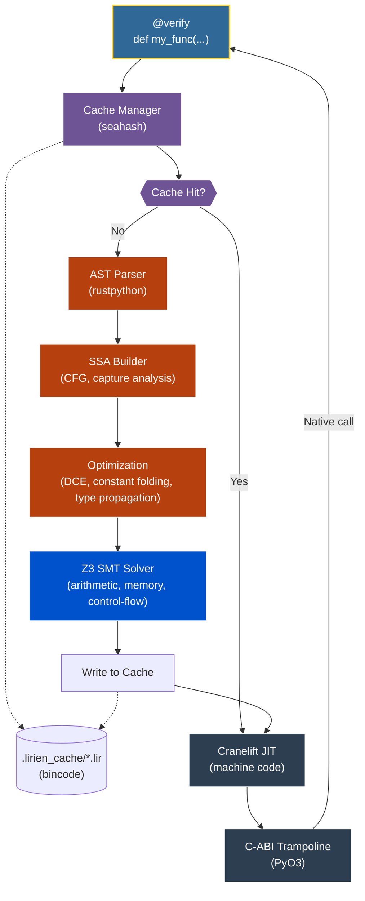

<div align="center">

# Lirien

**A Verifying JIT Compiler for a Safe Subset of Python**

[](https://www.gnu.org/licenses/agpl-3.0)
[](https://www.rust-lang.org/)
[](https://www.python.org/)
[](https://github.com/Z3Prover/z3)
[](https://cranelift.dev/)
[](https://deepwiki.com/SSL-ACTX/Lirien)

</div>

> [!WARNING]
> Lirien is an experimental research compiler. It is not production-ready, is under active development, and should not be used in critical systems.

---

Python's type annotations are unenforced at runtime. The standard trade-off is to accept the overhead of runtime checks and the Global Interpreter Lock (GIL) for safety, or to rewrite performance-critical code in a systems language at the cost of development complexity. Lirien takes a different approach: it treats type annotations as formal specifications, uses an SMT solver to prove their correctness at compile time, and then emits native machine code directly, bypassing the CPython interpreter.

The result is a compiler that can statically guarantee the absence of certain classes of errors—division by zero, out-of-bounds accesses, null pointer dereferences—while executing at native speed.

### Feature Overview

- **Refinement Types:** Logical predicates attached to types and verified by Z3 across all reachable control-flow paths.
- **Symbolic Refinement DSL (`V`):** Point-free predicate expressions written with the `V` placeholder instead of raw lambdas — composable with standard arithmetic and logical operators.
- **Flow-Sensitive Smart Casts:** After a `is None` guard, the compiler automatically narrows an `Optional[Box[T]]` to `Box[T]` in the taken branch, eliminating redundant null checks and enabling precise Z3 reasoning on the narrowed type.
- **Formal Memory Safety:** Z3 proves non-nullity before every pointer dereference and validates all buffer accesses against their declared bounds.
- **Verified Growable List (`List[T]`):** Heap-allocated dynamic arrays with bounds checking and length semantics fully modeled and verified by Z3.
- **Native Code Generation:** Functions decorated with `@verify` are compiled to machine code via Cranelift and called directly through a C-ABI trampoline, bypassing the CPython interpreter and GIL.
- **Flat Struct Layout:** `@struct` and `@value` types are compiled to C-compatible, flat memory layouts. Nested structs are inlined by byte offset, not represented as pointer chains.
- **Const Generics and Type-Level Arithmetic:** Integer dimensions are bound statically using `TypeVar`, and symbolic arithmetic (e.g., `N + 1`) is evaluated at JIT time.
- **Variadic Generics:** Tensor ranks and generic dimension sequences are expressed using `TypeVarTuple` and `Unpack`, enabling rank-polymorphic functions.
- **Monomorphization:** Generic functions (via `TypeVar`) are lazily specialized per concrete type at the call site.
- **SIMD Types:** Direct access to 128-bit CPU vector registers (`f32x4`, `f64x2`, `i8x16`, `i16x8`, `i32x4`, `i64x2`, `u8x16`, `u16x8`).
- **Loop Unrolling via `Literal`:** `typing.Literal`-typed integer parameters are treated as compile-time constants, enabling full CFG-level loop unrolling with exact Z3 induction values.
- **AOT IR Caching:** Verified SSA IR is serialized to disk (`.lirien_cache/`). On a cache hit, AST parsing and Z3 verification are skipped entirely.

## Table of Contents
- [Core Concepts & Examples](#core-concepts--examples)
  - [Refinement Types & Logic](#refinement-types--logic)
  - [Performance & Dispatch](#performance--dispatch)
  - [Data Structures](#data-structures)
  - [Developer Tooling](#developer-tooling)
- [Architecture & Pipeline](#architecture--pipeline)
- [Technical Specifications](#technical-specifications)
- [Getting Started](#getting-started)
- [Limitations & Roadmap](#limitations--roadmap)

---

## Core Concepts & Examples

### Refinement Types & Logic

#### Liquid Types: Statically Enforced Invariants
A refinement type is a base type paired with a logical predicate. Z3 checks that every assignment and function call satisfies the predicate along all reachable paths. Lirien can also infer postconditions automatically using `...`, deriving the tightest interval bounds via static analysis.

Both `Refined[T, pred]` and the standard PEP 593 `Annotated[T, pred]` syntax are accepted interchangeably.

```python
from typing import Annotated
from lirien import verify, i64, Refined

# These two are equivalent:
Positive = Refined[i64, lambda x: x > 0]
Positive = Annotated[i64, lambda x: x > 0]

@verify
def divide_verified(n: i64, d: Positive) -> i64:
    # Z3 proves d > 0 holds at this call site.
    # A ZeroDivisionError is statically impossible.
    return n // d

@verify
def clamp(x: i64) -> Refined[i64, ...]:
    # Lirien infers the postcondition: (and (>= {v} 1) (<= {v} 10))
    if x > 10: return 10
    if x < 1: return 1
    return x
```

#### Symbolic Refinement DSL (`V`)
The `V` object is a composable symbolic placeholder for the refined value. It supports standard comparison and arithmetic operators, producing predicate expressions without requiring an explicit `lambda`. Complex predicates can be built by chaining `&` and `|`.

```python
from lirien import verify, i64, Refined, V

# Equivalent to: Refined[i64, lambda x: x > 0]
Positive = Refined[i64, V > 0]

# Compound predicate — value must be in [1, 100] and odd.
BoundedOdd = Refined[i64, (V >= 1) & (V <= 100) & (V % 2 != 0)]

@verify
def next_odd(n: BoundedOdd) -> Refined[i64, V > 0]:
    return n + 2
```

#### Design by Contract: Preconditions, Postconditions, & Loop Invariants
In addition to refinement types on data structures, Lirien supports standard Design-by-Contract constructs using standard Python `assert` statements. Standard Python assertions are statically promoted by the compiler to formal Z3 proofs.

*   **Static Verification:** Z3 statically proves precondition asserts at all call sites, proves postcondition asserts at function return boundaries, and verifies loop invariant asserts inductively (on entry and back-edges).
*   **Runtime Enforcement:** If verified functions are called dynamically from regular Python code, Lirien automatically enforces precondition and postcondition asserts at runtime, raising `AssertionError` on violation.
*   **Zero Overhead:** Once Z3 formally proves these assertions, Lirien completely eliminates them from the JIT-compiled machine code.

```python
from lirien import verify, i64

@verify
def add_one(x: i64) -> i64:
    # 1. Precondition with custom error message
    assert 0 < x < 100, "x must be between 0 and 100"
    
    res = x + 1
    
    # 2. Postcondition with custom error message
    assert res > x, "result must be greater than input"
    return res

@verify
def sum_to_n(n: i64) -> i64:
    assert 0 <= n < 100, "n must be non-negative and less than 100"
    total = 0
    i = 0
    while i < n:
        # 3. Loop invariant with custom error message
        assert i >= 0, "loop index cannot be negative"
        assert total >= 0, "running total cannot be negative"
        total = total + i
        i = i + 1
    return total
```

#### Inductive Proofs: Recursive Functions
For recursive functions, Lirien applies inductive reasoning: it assumes the refinement holds for recursive calls and verifies that the base case and inductive step both satisfy the declared postcondition.

```python
from lirien import verify, i64, Refined

SmallPos = Refined[i64, lambda x: (0 <= x) & (x <= 20)]
StrictPositive = Refined[i64, lambda x: x >= 1]

@verify
def factorial(n: SmallPos) -> StrictPositive:
    if n <= 1:
        return 1
    # Z3 proves: for all n in SmallPos, n * factorial(n-1) >= 1
    return n * factorial(n - 1)
```

#### Higher-Order Functions
Closures and lambdas are supported with full capture analysis. The captured environment is heap-allocated and tracked through the type system.

```python
from lirien import verify, i64, Closure

@verify
def make_adder(x: i64) -> Closure[[i64], i64]:
    return lambda y: x + y
```

---

### Performance & Dispatch

#### GIL-free Parallelism
Lirien functions operate on raw memory rather than CPython objects, which means they can be executed across multiple OS threads without acquiring the GIL.

```python
from lirien import verify, parallel_for, Buffer, f64, i64

@verify
def parallel_scale(vec: Buffer[f64], factor: f64) -> None:
    def body(i: i64):
        vec[i] *= factor
    parallel_for(range(len(vec)), body)
```

#### Static Dispatch via `typing.Protocol`
`typing.Protocol` is used to express structural interfaces. Both `@struct` and `@adt` types can implement protocols. Functions accepting a Protocol parameter are monomorphized at the call site: a separate, specialized machine-code body is emitted for each concrete type, eliminating dynamic dispatch and vtable lookups.

```python
from typing import Protocol
from lirien import verify, f32, struct, adt

class Renderable(Protocol):
    def render(self) -> f32: ...

@struct
class Circle:
    radius: f32
    def render(self) -> f32:
        return self.radius * 3.14

@adt
class Shape:
    Rect: f32
    Dot: f32
    def render(self) -> f32:
        match self:
            case Shape.Rect(w): return w * w
            case Shape.Dot(_):  return 0.0

@verify
def draw(obj: Renderable) -> f32:
    # Compiled as a direct call to Circle_render or Shape_render.
    return obj.render()
```

#### Null-Pointer Optimization & Flow-Sensitive Smart Casts
`Optional[Box[T]]` (equivalently `Box[T] | None`) is represented as a raw 64-bit pointer where `None` is the address `0x0`. No wrapper object is allocated. Z3 proves non-nullity before every dereference; accessing `.val` or any field on a potentially-null pointer without a prior `None` check is a compile-time error.

The compiler also performs **flow-sensitive smart casts**: after an `is None` (or `is not None`) guard, the type of the variable is automatically narrowed in the respective branch. The SSA builder inserts a cast instruction, and Z3 reasons about the narrowed type with exact precision — no redundant solver queries.

```python
@struct
class Node:
    val: i64
    next: Optional[Box["Node"]]

@verify
def sum_list(n: Optional[Box[Node]]) -> i64:
    if n is None: return 0
    # After the guard, `n` is narrowed to Box[Node].
    # Z3 knows n != 0x0 here; .val is safe without an additional check.
    return n.val + sum_list(n.next)

# Python 3.10+ union syntax is also supported:
@verify
def increment(n: Box[Node] | None) -> i64:
    if n is None: return -1
    return n.val + 1
```

#### Monomorphization and Const Generics
`TypeVar` is used for generic type parameters and for integer "const generics" (integer dimensions bound at JIT time). Symbolic arithmetic on these dimensions (e.g., `N + 1`) is evaluated during compilation to produce exact, specialized machine code.

```python
from typing import TypeVar
from lirien import verify, i64, f64, SizedArray

T = TypeVar("T", i64, f64)
N = TypeVar("N")  # Const generic integer

@verify
def pad_one(x: SizedArray[T, N], out: SizedArray[T, N + 1]) -> i64:
    for i in range(N):
        out[i] = x[i]
    return N + 1
```

#### Multiple Dispatch via `@overload`
`typing.overload` is used to declare ad-hoc polymorphism. The compiler resolves overloads at the call site and JIT-compiles a distinct machine-code body for each matched signature.

```python
from typing import overload
from lirien import verify, i64, f64

@overload
def compute(x: i64) -> i64: ...

@overload
def compute(x: f64) -> f64: ...

@verify
def compute(x):
    return x * 2

compute(10)   # Dispatches to specialized i64 body.
compute(2.5)  # Dispatches to specialized f64 body.
```

#### Loop Unrolling via `typing.Literal`
Parameters typed as `typing.Literal[N]` are treated as compile-time integer constants. The compiler unrolls loops bounded by these values entirely, producing a flat sequence of instructions, and gives Z3 exact induction values for each iteration.

```python
from typing import Literal
from lirien import verify, i64

@verify
def unrolled_sum(limit: Literal[5]) -> i64:
    total = 0
    # Expanded into 5 discrete add instructions.
    for i in range(limit):
        total += i
    return total
```

#### AOT IR Caching
The `@verify` decorator hashes the function's source text, the memory layouts of its parameter types, and the current compiler version. If a matching `.lir` binary exists in `.lirien_cache/`, the function is loaded directly into Cranelift for code generation, skipping AST parsing and Z3 verification entirely.

#### SIMD Execution
Lirien exposes 128-bit CPU vector registers as first-class types. Arithmetic on these types lowers to single native SIMD instructions. Scalar literals are automatically broadcast ("splatted") to all lanes.

```python
from lirien import verify, i8x16

@verify
def process_pixels(a: i8x16, b: i8x16) -> i8x16:
    # Compiles to two SIMD instructions: vpadd + vpsub
    return (a + b) - 10
```

---

### Data Structures

#### C-Compatible Struct Layout
`@struct` types are compiled to flat, C-ABI-compatible memory layouts. Nested structs are inlined by absolute byte offset rather than represented as pointers. Refinement predicates can reference nested fields.

`@struct` and `@value` classes automatically receive field-by-field `__repr__` and `__eq__` implementations at class-creation time, so they work naturally in Python test code and REPL sessions without any extra boilerplate.

```python
from lirien import struct, f64, i32, Refined

@struct
class Point:
    x: f64
    y: f64

@struct
class Trace:
    p: Point  # Inlined at offset 0; id at offset 16.
    id: i32

SafeTrace = Refined[Trace, lambda t: t.p.x > 0]

# Auto-derived behaviour:
p = Point(1.0, 2.0)
print(p)          # Point(x=1.0, y=2.0)
assert p == Point(1.0, 2.0)  # True
```

#### Stack-Allocated Value Types
`@value` types have value semantics and are stack-allocated. They are laid out contiguously in memory without indirection, which makes them suitable for use as elements in `Buffer[T]` and similar contiguous containers.

```python
from lirien import value, i64, Buffer, verify

@value
class Point3D:
    x: i64
    y: i64
    z: i64

@verify
def process_points(data: Buffer[Point3D]) -> None:
    for i in range(len(data)):
        total = data[i].x + 1
```

#### Tensors and Rank Polymorphism
`Tensor[T, *Shape]` carries its element type and shape at the type level. `TypeVarTuple` and `Unpack` allow a single function to operate on tensors of arbitrary rank, capturing all dimensions as a compile-time sequence.

```python
from typing import TypeVarTuple, Unpack
from lirien import verify, Tensor, f32, i64

Shape = TypeVarTuple("Shape")

@verify
def get_rank(a: Tensor[f32, Unpack[Shape]]) -> i64:
    return len(Shape)

t1 = Tensor.alloc((10,), f32)
get_rank(t1)  # Returns 1.

t3 = Tensor.alloc((2, 3, 4), f32)
get_rank(t3)  # Returns 3.
```

#### Tensor Arithmetic and Kernel Fusion
Element-wise arithmetic operators (`+`, `-`, `*`, `/`) are first-class on `Tensor` types and lower to native kernels. Scalar operands are automatically broadcast across all elements.

Compound expressions are **kernel-fused** at the IR level: an expression like `a * b + d` is not split into two separate passes over memory. The optimizer detects the chain, emits a single fused kernel instruction (`tmul` → `tadd` folded), and Cranelift lowers it to one native call — no intermediate tensor allocation.

```python
from lirien import verify, Tensor, f32

@verify
def scale(a: Tensor[f32, "M", "N"], s: f32) -> Tensor[f32, "M", "N"]:
    return a * s  # scalar broadcast — one kernel

@verify
def fma(
    a: Tensor[f32, "M", "N"],
    b: Tensor[f32, "M", "N"],
    d: Tensor[f32, "M", "N"],
) -> Tensor[f32, "M", "N"]:
    return a * b + d  # fused — single kernel, no intermediate allocation
```

#### Algebraic Data Types and Result
`@adt` defines tagged unions with named variants. Dispatch is compiled to a Cranelift `switch`-based jump table for O(1) variant selection. Z3 verifies that all `match` blocks are exhaustive and that variant fields are accessed only when the correct tag is active. Match arms support guards (`if <condition>`) which are also fully Z3-verified.

```python
from lirien import verify, i64, f64, adt, Box, Result, Ok, Err

@adt
class Node:
    Cons: (i64, Box["Node"])
    Nil: None

@verify
def sum_list(n: Node) -> i64:
    match n:
        case Node.Cons(val, next):
            return val + sum_list(next)
        case Node.Nil:
            return 0

@adt
class Shape:
    Circle: f64
    Rectangle: (i64, i64)

@verify
def classify(s: Shape) -> i64:
    match s:
        case Shape.Circle(r) if r > 10.0:  # guard — Z3 verified
            return 1  # large
        case Shape.Circle(_):
            return 2  # small
        case _:
            return 0

@verify
def safe_div(a: i64, b: i64) -> Result[i64, i64]:
    if b == 0:
        return Err(0)
    return Ok(a // b)
```

#### Pattern Matching Destructuring
Lirien supports Python 3.10's `match` statement for destructuring structural types like standard `tuple`, `NamedTuple`, and `@struct`. Matching is compiled into sequential conditional jumps on struct field offsets. Match cases can also specify guards, which are statically verified by Z3.

```python
from typing import NamedTuple
from lirien import verify, struct, i64

class Point(NamedTuple):
    x: i64
    y: i64

@struct
class Point3D:
    x: i64
    y: i64
    z: i64

@verify
def match_tuple(t: tuple[i64, i64]) -> i64:
    match t:
        case (x, y) if x > y:
            return x - y
        case (x, y):
            return y - x

@verify
def match_struct(p: Point3D) -> i64:
    match p:
        case Point3D(x, y, z) if x > y:
            return x
        case Point3D(x, y, z) if y > z:
            return y
        case Point3D(x, y, z):
            return z
```

#### Tuples and NamedTuples: Register Flattening
Standard `tuple` and `NamedTuple` types are recursively flattened into their primitive constituents for parameter passing and return values. Tuples of up to 16 bytes (2 registers) are passed entirely in registers. Larger aggregates use a return-by-pointer (SRet) convention but remain flattened as individual arguments.

```python
from typing import NamedTuple
from lirien import verify, i64

class Point(NamedTuple):
    x: i64
    y: i64

@verify
def scale_nested(data: tuple[Point, i64]) -> Point:
    [p, factor] = data
    return Point(p.x * factor, p.y * factor)

# At the ABI level: three i64 inputs (x, y, factor), two i64 outputs (new_x, new_y).
```

#### `TypedDict`: Zero-Cost Struct-Like Dicts
`TypedDict` types are compiled to the same flat, C-ABI-compatible memory layout as `@struct`. String key accesses (`cfg["timeout"]`) are resolved to absolute byte offsets at compile time and completely eliminated from the emitted code — no hashing, no dictionary lookup at runtime.

```python
from typing import TypedDict
from lirien import verify, i64

class Config(TypedDict):
    id: i64
    timeout: i64
    enabled: bool

@verify
def configure(cfg: Config) -> i64:
    # Compiles to: load.i64 (base_ptr + 8) — the string key is gone.
    if cfg["enabled"]:
        return cfg["timeout"]
    return 0
```

#### Verified Growable Lists (`List[T]`)
`List[T]` represents a dynamically-sized list stored on the heap. Z3 models the list length and validates all index accesses against the dynamic bounds of the list to prevent out-of-bounds reads and writes.

```python
from lirien import verify, List, i64, Refined

@verify
def safe_index(l: List[i64], idx: i64) -> i64:
    # Z3 verifies index safety. Accessing l[idx] directly without guards is a compile error.
    if idx >= 0 and idx < len(l):
        return l[idx]
    return 0

@verify
def build_list() -> List[i64]:
    l = List[i64]()
    l.append(42)
    l.append(100)
    return l
```

#### Buffer Interop and Zero-Copy Slicing
`Buffer[T]` wraps any object implementing the Python buffer protocol (including NumPy arrays). Loop indices over a `Buffer` are bounded by its declared length and verified by Z3. Slicing (on both `Buffer` and `SizedArray`) produces a zero-copy memory view; Z3 proves the slice is within the original buffer's bounds.

Lirien supports slicing with strides (e.g. `arr[start:end:step]`), including positive steps, negative steps, and reverse slicing. Z3 formally verifies all bounds checks and calculates the resulting slice size statically.

```python
from lirien import verify, SizedArray, Buffer, i64, f64

@verify
def slice_with_step_two(arr: SizedArray[i64, 10]) -> i64:
    # elements at indices 0, 2, 4, 6, 8 (size = 5)
    s = arr[0:10:2]
    return s[0] + s[1] + s[2]

@verify
def slice_reverse_step_one(arr: SizedArray[i64, 10]) -> i64:
    # elements at 9, 8, 7, 6, 5 in reverse order (size = 5)
    s = arr[9:4:-1]
    return s[0] + s[1] + s[2]

@verify
def scale_vector(vec: Buffer[f64], factor: f64) -> None:
    # Z3 proves i is in [0, len(vec)) for all loop iterations.
    for i in range(len(vec)):
        vec[i] *= factor

@verify
def sum_slice(data: Buffer[i64], start: i64) -> i64:
    # Z3 proves start is valid and data[start:] is within bounds.
    view = data[start:]
    total = 0
    for i in range(len(view)):
        total += view[i]
    return total

@verify
def sum_direct(buf: Buffer[i64]) -> i64:
    # Direct iteration — no explicit index needed.
    total = 0
    for x in buf:
        total = total + x
    return total
```

`Buffer[...]` (ellipsis element type) defers the element type to the runtime format of the passed memoryview. Lirien infers and specializes the function body for the concrete type on the first call.

```python
import array
from lirien import verify, Buffer, f32

@verify
def buf_sum(buf: Buffer[...]) -> f32:
    s = 0.0
    for i in range(len(buf)):
        s += buf[i]
    return s

data = array.array("f", [1.0, 2.0, 3.0, 4.0])
buf_sum(memoryview(data))  # element type inferred as f32 at call time
```

---

### Developer Tooling

#### `@jit`: Skip Verification, Keep Speed
`@jit` compiles a function directly to native machine code via Cranelift, bypassing Z3 entirely. Use it for hot paths whose correctness is guaranteed by construction or by upstream `@verify` callers.

```python
from lirien import jit, i64

@jit
def fast_sum(a: i64, b: i64) -> i64:
    return a + b
```

#### `no_verification`: Temporarily Disable Z3 for a Block
`no_verification()` is a thread-local context manager that disables Z3 verification for every `@verify`-decorated function compiled while the block is active. Useful in test fixtures or benchmarking scaffolding where verification latency is undesirable.

```python
from lirien import verify, no_verification, i64

with no_verification():
    # These functions are compiled without Z3 — Cranelift only.
    @verify
    def bench_target(x: i64) -> i64:
        return x * x
```

#### `tracing()`: Scoped Per-Subsystem Tracing
`tracing()` is a nestable context manager that configures structured log output for specific compiler subsystems for the duration of the block, then restores the prior configuration on exit. It stacks correctly with nested `with tracing(...)` blocks.

```python
from lirien import verify, tracing, LIVENESS, VERIFY, SSA, Z3

with tracing({VERIFY: "debug", Z3: "trace", SSA: "info"}):
    @verify
    def checked_fn(x: i64) -> i64:
        return x + 1

# configure_tracing() is still available for persistent, global configuration.
from lirien import configure_tracing, BACKEND
configure_tracing({BACKEND: "warn"})
```

#### Source-Level Diagnostics
Verification failures are reported with source file, line, and column information. The IR carries `SourceLocation` metadata that maps every instruction back to the original Python source.

```text
[Lirien Warning] Lirien Verification Failed for 'divide_unsafe': Potential division by zero at v2
  --> source.py:3:12
   |
 3 |    return n // d
   |                ^--- Logic error detected here
```

---

## Architecture & Pipeline

Lirien is structured as a multi-crate Rust workspace (`crates/`) with a Python frontend package (`python/lirien/`). The PyO3-based bridge crate (`lirien-bridge`) exposes the compiler to Python and handles caching.



### Compilation Stages

1. **Interception and hashing (`lirien-bridge`):** The `@verify` decorator intercepts the Python function. Its source text, parameter type layouts, and the current compiler version are hashed with `seahash`.
2. **AOT cache lookup:** If a matching `.lir` binary exists in `.lirien_cache/`, the verified IR is deserialized and passed directly to stage 6.
3. **AST lowering to SSA IR (`lirien-ir`):** On a cache miss, the Python AST is parsed by `rustpython` and lowered into Lirien's SSA-form Intermediate Representation. The builder constructs the Control Flow Graph, resolves variable scopes, and performs closure capture analysis.
4. **Optimization (`lirien-ir`):** The IR is processed by several passes: dead code elimination (DCE), constant folding, and type propagation.
5. **Formal verification (`lirien-verify`):** Every arithmetic operation, memory access, and branch condition is encoded as SMT-LIB constraints and discharged by Z3. Refinement type predicates are checked against all reachable paths. The verifier uses interval analysis to skip solver calls for constraints that are trivially provable within known value ranges.
6. **Code generation (`lirien-backend`):** The verified SSA IR is lowered to Cranelift IR and compiled to native machine code stored in an executable memory buffer.
7. **Trampoline installation:** PyO3 installs a C-ABI function pointer as the `__call__` target of the original Python function object. Subsequent calls bypass the interpreter entirely.

---

## Technical Specifications

| Component | Detail |
| :--- | :--- |
| **Crate structure** | `lirien-core`, `lirien-ir`, `lirien-verify`, `lirien-backend`, `lirien-bridge` |
| **Scalar types** | `i8`, `u8`, `i16`, `u16`, `i32`, `u32`, `i64`, `u64`, `f32`, `f64`, `bool` |
| **SIMD types** | `f32x4`, `f64x2`, `i8x16`, `u8x16`, `i16x8`, `u16x8`, `i32x4`, `i64x2` |
| **Generics** | Monomorphization via `TypeVar`; rank polymorphism via `TypeVarTuple` |
| **Const generics** | Integer `TypeVar` dimensions with symbolic arithmetic (`N + 1`) |
| **Callable types** | `FnPointer`, `Closure`, `Callable` |
| **Aggregate types** | `@struct`, `@value`, `tuple`, `NamedTuple`, `@adt`, `Box`, `SizedArray`, `Buffer`, `Tensor`, `List` |
| **Concurrency** | `parallel_for` on raw memory buffers (no GIL) |
| **SMT solver** | Z3 v4.12+ — bitvector, floating-point, and array theories |
| **JIT backend** | Cranelift 0.100+ |
| **IR serialization** | `bincode` (format), `seahash` (cache key) |
| **Python interop** | PyO3, `ctypes`, NumPy buffer protocol |
| **Optimization passes** | DCE, constant folding, type propagation, loop unrolling, flow-sensitive type narrowing |
| **Diagnostics** | Source-mapped error locations, per-subsystem `tracing()` context manager |
| **Decorator variants** | `@verify` (Z3 + JIT), `@jit` (JIT only, no Z3) |
| **Refinement DSL** | `V` symbolic placeholder; `Refined[T, V > 0]` point-free predicate syntax |
| **Optional safety** | Pointer optionals (`Box[T] \| None`) and non-pointer value-type optionals (`T \| None`) with flow-sensitive smart casts |
| **Auto-derived methods** | `__repr__` and `__eq__` on `@struct`, `@value`, and `@adt` types |

---

## Getting Started

### Prerequisites
- Rust toolchain (stable, 1.80 or later)
- Python 3.10 or later
- Z3 shared library (v4.12 or later)
- `maturin` (Python build tool)

### Build and Test

```bash
# Verify the Rust workspace compiles cleanly.
cargo check

# Build and install the Python extension module.
maturin develop --release

# Run the Rust unit tests.
cargo test

# Run the Python integration test suite.
PYTHONPATH=./python python -m unittest discover tests/python
```

---

## Limitations & Roadmap

### Verifying vs. Verified
Lirien is a *verifying compiler*: it uses formal methods to prove properties of its input programs. It is not a *formally verified compiler*: the compiler implementation itself (the Rust codebase) has not been proven correct against a formal specification. Bugs in the compiler or the Z3 encoding could theoretically allow an unsafe program to pass verification.

### Closed-World Assumption
To maintain sound verification, Lirien restricts the subset of Python it accepts:
- Dynamic attribute access (`getattr`, `setattr`, `__dict__`) is not supported.
- `eval()` and `exec()` are not supported.
- All function parameters and return types must carry explicit annotations.

### Roadmap

All currently planned core features have been implemented.

---

<div align="center">

Built with 🦀 & 🐍 by [Seuriin](https://github.com/SSL-ACTX)

</div>
