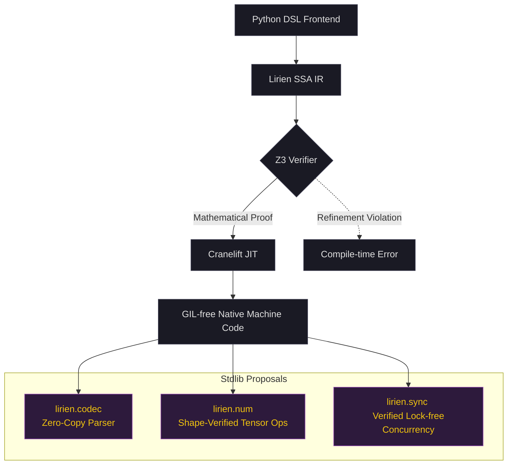

# Lirien Standard Library (stdlib) Proposals

Lirien's unique combination of **formal mathematical verification (Z3)**, **low-level memory control (SSA, flat layouts)**, and **GIL-free native execution (Cranelift)** opens the door for standard library modules that are impossible or highly impractical in standard Python or traditional systems languages.

Here are three highly unique standard library concepts designed specifically to leverage Lirien's core strengths.

---



---

## 1. `lirien.codec` — Statically Verified, Zero-Copy Binary Serialization

### The Problem in Systems & Python
Parsing binary protocols (like DNS, Protobuf, CBOR, or custom network packets) is either:
1. **Slow and high-overhead** (standard Python, due to object allocation and dynamic typing).
2. **Fast but dangerous** (C/C++, where buffer overflows and pointer arithmetic bugs lead to critical CVEs).
3. **Safe but complex** (Rust, requiring extensive lifetimes and bounds checking).

### The Lirien Solution
`lirien.codec` provides a DSL to define binary structures using `@struct` and parses them with **zero allocations, zero copies, and mathematical proof of no out-of-bounds reads/writes**.

### Example: A Verified Packet Parser

```python
from typing import Annotated
from lirien import verify, struct, i64, u8, u16, Refined, Buffer, V

# A type representing a valid offset within a buffer of size N
def OffsetWithin(N: i64):
    return Refined[i64, (V >= 0) & (V < N)]

@struct
class PacketHeader:
    magic: u16
    payload_len: Annotated[i64, (V >= 0) & (V <= 1024)]
    checksum: u8

@struct
class Packet:
    header: PacketHeader
    # A slice of the original buffer, size verified to match payload_len exactly
    payload: Buffer[u8]

@verify
def parse_packet(buf: Buffer[u8]) -> Packet | None:
    # 1. Statically ensure buffer is large enough for the header
    if buf.len() < 7: # sizeof(PacketHeader)
        return None
    
    # 2. Zero-copy cast: View the front of the buffer as a PacketHeader.
    # Z3 proves this is safe because buf.len() >= 7.
    header = buf.cast_to(PacketHeader, offset=0)
    
    # 3. Verify the magic number
    if header.magic != 0x4C52: # "LR"
        return None
        
    # 4. Verify we have enough bytes left in the buffer for the payload
    needed_bytes = 7 + header.payload_len
    if buf.len() < needed_bytes:
        return None
        
    # 5. Extract payload slice.
    # Z3 proves the slice [7:needed_bytes] is within bounds of buf.
    payload_slice = buf.slice(7, needed_bytes)
    
    return Packet(header=header, payload=payload_slice)
```

> [!TIP]
> **Why this is unique:** The compiler completely eliminates runtime bounds checks inside the packet parsing logic because Z3 mathematically proves the slice boundaries are safe before emitting machine code.

---

## 2. `lirien.num` — Shape-Verified Linear Algebra & DSP

### The Problem
Scientific computing libraries like NumPy or PyTorch check tensor dimensions at runtime. If you pass a $(3, 4)$ matrix into a function expecting a $(4, 2)$ matrix, it runs fine until it hits the multiplication step, where it crashes.

### The Lirien Solution
Using Lirien's **const generics** and **variadic shape generics (`TypeVarTuple`)**, `lirien.num` verifies dimension compatibility at compile time. It also utilizes SIMD registers (`f32x4`, etc.) and `parallel_for` to run computations GIL-free.

### Example: Compile-Time Shape Verification

```python
from typing import TypeVar, TypeVarTuple, Unpack
from lirien import verify, Tensor, f32, i64

# Generic dimensions
M = TypeVar("M", bound=i64)
N = TypeVar("N", bound=i64)
K = TypeVar("K", bound=i64)
Batch = TypeVarTuple("Batch")

@verify
def batch_matmul(
    a: Tensor[f32, Unpack[Batch], M, K],
    b: Tensor[f32, Unpack[Batch], K, N]
) -> Tensor[f32, Unpack[Batch], M, N]:
    # The compiler uses Z3 to verify that the inner dimension 'K' matches.
    # If a user attempts to pass mismatched shapes, it fails to compile.
    # The resulting JIT code runs GIL-free using SIMD vectorization.
    return a @ b
```

> [!NOTE]
> We can expand this into a full DSP (Digital Signal Processing) suite, including verified **1D/2D Convolutions** (proving kernel/signal boundaries) and **FFT** algorithms.

---

## 3. `lirien.sync` — Verified Lock-Free Concurrency

### The Problem
Writing concurrent code without a GIL is notoriously difficult. Data races, deadlock, and memory corruption (due to reordering or ABA problems) are common.

### The Lirien Solution
With Lirien's `parallel_for` and raw memory buffers, we can implement high-performance lock-free data structures. We use refinement types to prove state transition invariants in Z3 (e.g., proving a ring buffer's write pointer never overtakes its read pointer, preventing data overwrites).

### Example: Single-Producer Single-Consumer (SPSC) Queue

```python
from typing import Generic, TypeVar
from lirien import verify, struct, i64, SizedArray, V, Annotated

T = TypeVar("T")
Capacity = TypeVar("Capacity", bound=i64)

@struct
class SPSCQueue(Generic[T, Capacity]):
    buffer: SizedArray[T, Capacity]
    # Write and read indices are mapped to Z3 integer variables
    write_idx: i64
    read_idx: i64

    # Invariant: 0 <= write_idx - read_idx <= Capacity
    # This invariant is enforced on every operation.

@verify
def try_enqueue(queue: SPSCQueue[T, Capacity], item: T) -> bool:
    w = queue.write_idx
    r = queue.read_idx
    
    # Check if queue is full
    if w - r >= Capacity:
        return False
        
    # Calculate ring index
    ring_idx = w % Capacity
    
    # Z3 proves ring_idx is always in [0, Capacity-1], 
    # making this array access guaranteed to be in-bounds.
    queue.buffer[ring_idx] = item
    queue.write_idx = w + 1
    return True
```

---

## Comparison Matrix

| Library | Primary Benefit | Unique Value Proposition |
| :--- | :--- | :--- |
| **`lirien.codec`** | Ultimate safety + Speed | Mathematically guaranteed safe binary parsing without any runtime bounds checking overhead. |
| **`lirien.num`** | Error-free Math / DSP | Static prevention of dimension/shape mismatches in complex pipelines (like neural network layers or Kalman filters). |
| **`lirien.sync`** | GIL-free Concurrency | Lock-free data structures where pointer/index safety and ring-buffer boundary invariants are formally proven. |
